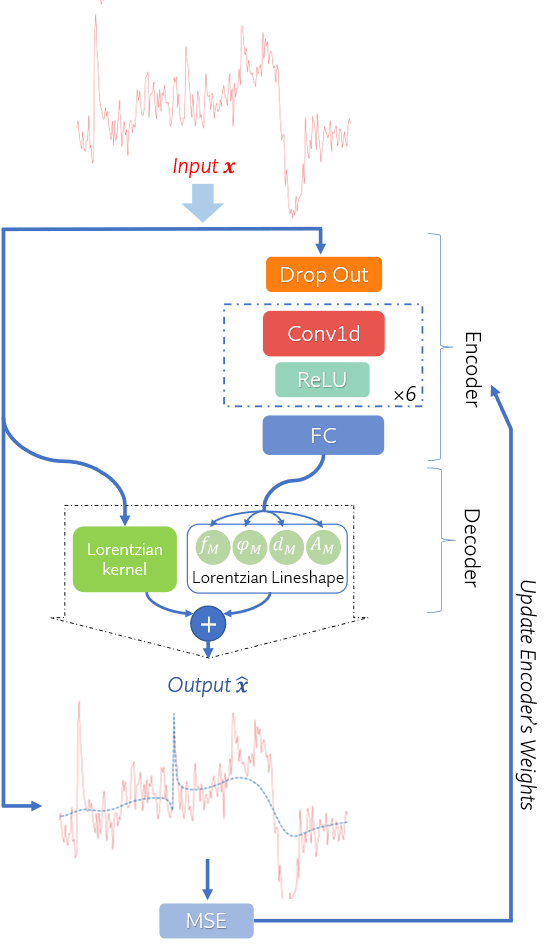

# DeepFPC
This repository provides the implementation of DeepFPC from the following paper:

Model-Informed unsupervised Deep Learning Approach to Frequency and Phase Correction of MRS Signals: [Link to arxiv]

### How it works?
- DeepFPC was implemented in Python with the help of the Pytorch lightning interface. 
- For each experiment, a "run" json file should be created. All parameters of the deep neural network and data can be stated in the json file.
There is examples of "run" json files which can be found in the "runs" folder.
- The network can be trained and tested simply by running "main.py". 
- Engine.py controlls the pre and post training steps for training and testing. dotrain() and dotest() are two function for training and testing modes, respectively.
- Model.py is an object inherited from pytorch lightning's "LightningModule". Now it contains two neural network(ConvNet & MLPNet), but you can easily add your model. Deep spectral registration model and Deep Cr refrencing model are implemented as dCr() and dSR() functions. 
### Proposed DAE for Deep Learning-based Peak Referencing

### Result

