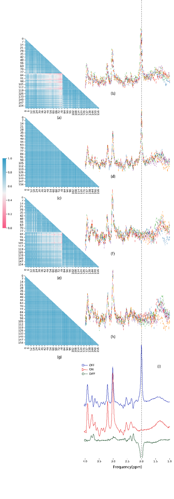

# DeepFPC
This repository provides the implementation of DeepFPC from the following paper:

Model-Informed unsupervised Deep Learning Approach to Frequency and Phase Correction of MRS Signals: [Link to arxiv]

## How it works?
- DeepFPC was implemented in Python with the help of the Pytorch lightning interface. 
- For each experiment, a "run" json file should be created. All parameters of the deep neural network and data can be stated in the json file.
There is examples of "run" json files which can be found in the "runs" folder.
- The network can be trained and tested simply by running "main.py". 
- Engine.py controlls the pre and post training steps for training and testing. dotrain() and dotest() are two function for training and testing modes, respectively.
- Model.py is an object inherited from pytorch lightning's "LightningModule". Now it contains two neural network(ConvNet & MLPNet), but you can easily add your model. Deep spectral registration model and Deep Cr refrencing model are implemented as dCr() and dSR() functions. 
------
## Proposed DAE for Deep Learning-based Peak Referencing

------
## Result
### Phantom

### GABA-edited in-vivo dataset(Big GABA[])
||
|:--:|
| An example of FPC using dCrR for a test set in the GABA-edited in-vivo dataset. Unedited spectra (a) and their similarity matrix (b) before FPC. Unedited spectra (c) and their similarity matrix (d) after FPC. Edited spectra (e) and their similarity matrix (f) before FPC. Edited spectra (g) and their similarity matrix (h) after FPC. (i) Average corrected spectra using dCrR (blue, unedited; red, edited) and their difference (dark green). dCrR, deep learning-based Creatine referencing|
-----
## Acknowledgments
This project has received funding from the European Union's Horizon 2020 research and innovation program under the Marie Sklodowska-Curie grant agreement No 813120.

## Citation
If you use this codebase, or otherwise found our work valuable, please cite:
```
@article{
}
```
